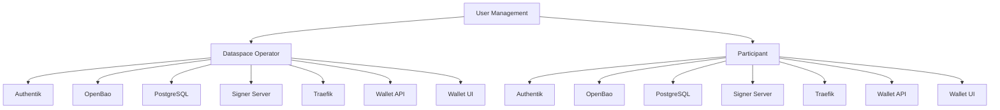
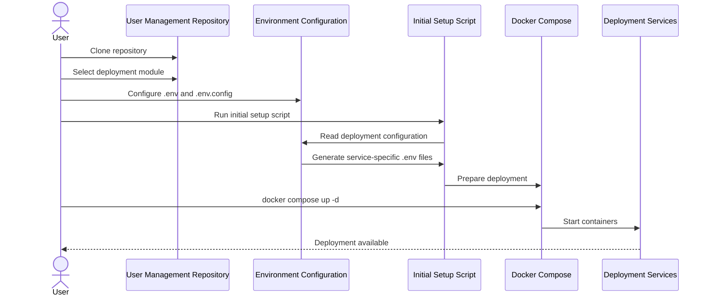

# User Management

User Management provides the deployment and configuration tooling required to provision services for **Dataspace Operators** and **Participants** in the Ocean Enterprise Marketplace ecosystem.

The repository contains two independent deployment modules:

- [Dataspace Operator](./dataspace-operator/README.md)
- [Participant](./participant/README.md)

Each module provides a complete Docker Compose based deployment stack with authentication, secrets management, database, signing, networking, and wallet services.

---

## Motivation

The Ocean Enterprise Marketplace requires both Dataspace Operators and Participants to have a consistent set of supporting services for identity, authentication, secrets, signing, networking, and wallet management.

This repository centralizes the deployment configuration and initialization logic required to provision those services.

The goal is to make deployments:

- reproducible;
- configurable through a small set of input files;
- easy to initialize on a fresh host;
- consistent between Dataspace Operator and Participant deployments;
- secure by keeping generated credentials and secrets out of the source configuration.

---

## Scope

User Management is responsible for deploying and configuring the supporting services required by Dataspace Operators and Participants.

The repository contains two deployment stacks:



The Dataspace Operator and Participant deployments share common infrastructure components, but each has role-specific configuration and Authentik blueprints.

---

## Repository Structure

The repository is organized as follows:

```text
user-management/
├── dataspace-operator/
│   ├── authentik/
│   ├── docker-compose/
│   ├── .env
│   ├── .env.config
│   ├── dataspace_operator_environment_configuration.py
│   ├── dataspace-operator-initial-setup.sh
│   └── requirements.txt
│
├── participant/
│   ├── authentik/
│   ├── docker-compose/
│   ├── .env
│   ├── .env.config
│   ├── participant_environment_configuration.py
│   ├── participant-initial-setup.sh
│   └── requirements.txt
│
├── .gitignore
└── README.md
```

The service-specific `.env` files are **generated during the initial setup** and therefore are intentionally not shown in the source directory structure above.

---

# Prerequisites

Before starting a deployment, make sure the host satisfies the following requirements.

## Operating System

The initial setup scripts are intended to run on Unix-based systems.

Supported distributions include:

- Fedora
- Alpine Linux
- openSUSE
- CentOS

The setup scripts rely on standard Unix shell utilities and Docker tooling.

## Required Software

Install the latest stable versions of:

- Git
- Docker
- Docker Compose

Docker Compose should be available through the `docker compose` command.

Verify the installation:

```bash
docker --version
docker compose version
git --version
```

Python is also required for the environment configuration scripts. The Python dependencies for each deployment are listed in the corresponding `requirements.txt`.

---

# Configuration

Each deployment has two main configuration files:

```text
.env
.env.config
```

These files have different purposes.

## `.env`

The `.env` file contains the **Docker image tags/versions** used by the deployment.

It is used to control which versions of the required container images are deployed.

Example:

```text
SERVICE_IMAGE_TAG=...
```

The exact variables depend on the deployment.

## `.env.config`

The `.env.config` file contains the deployment configuration used by the environment configuration script.

It is used to generate the `.env` files required by individual services.

The configuration flow is:

```text
.env
   │
   └── Image tags / versions

.env.config
   │
   └── Deployment configuration
             │
             ▼
environment configuration script
             │
             ▼
generated service-specific .env files
```

Users should configure the input files rather than manually editing generated service-specific `.env` files.

---

# Generated `.env` Files

The initial setup script generates service-specific environment files from `.env.config`.

Depending on the deployment, generated files include:

```text
docker-compose/authentik/.env.authentik
docker-compose/openbao/.env.openbao
docker-compose/postgres-init/.env.postgres
docker-compose/signer-server/.env.signer-server
docker-compose/traefik/.env.traefik
docker-compose/wallet-api/.env.wallet-api
docker-compose/wallet-ui/.env.wallet-ui
```

These files should be considered **generated artifacts**.

Do not manually configure them unless you are debugging or developing the deployment tooling.

If a generated value needs to change, update the appropriate source configuration and run the setup/configuration process again.

---

# Deployment Workflow

Both deployment modules follow the same general workflow:



For deployment-specific instructions, use:

- [Dataspace Operator deployment](./dataspace-operator/README.md)
- [Participant deployment](./participant/README.md)

---

# Dataspace Operator

The Dataspace Operator module provisions the services required by a Dataspace Operator.

It includes:

- Authentik
- OpenBao
- PostgreSQL
- Signer Server
- Traefik
- Wallet API
- Wallet UI
- Operator-specific environment configuration
- Participant onboarding tooling

See the [Dataspace Operator README](./dataspace-operator/README.md) for configuration and deployment instructions.

---

# Participant

The Participant module provisions the services required by a Participant.

It includes:

- Authentik
- OpenBao
- PostgreSQL
- Signer Server
- Traefik
- Wallet API
- Wallet UI
- Participant-specific environment configuration

See the [Participant README](./participant/README.md) for configuration and deployment instructions.

---

# Security

The deployment handles authentication credentials, secrets, certificates, private keys, and other security-sensitive configuration.

Never commit production secrets or private keys to the repository.

In particular, treat the following as sensitive:

```text
.env.config
certs/
secrets/
private_keys/
generated .env files
```

Before using a deployment in production:

- use production credentials;
- use valid production TLS certificates;
- protect private keys;
- restrict access to OpenBao;
- review exposed ports and Traefik routes;
- secure persistent Docker volumes;
- ensure generated environment files are not committed.

---

# Troubleshooting

Check the status of the deployment:

```bash
docker compose ps
```

View service logs:

```bash
docker compose logs
```

Follow the logs of a specific service:

```bash
docker compose logs -f <service-name>
```

If a deployment fails during initialization, check:

1. `.env`
2. `.env.config`
3. generated service-specific `.env` files
4. certificates
5. Docker availability
6. required ports
7. service logs

For deployment-specific troubleshooting, refer to the corresponding module README.

---

# Related Documentation

- [Dataspace Operator README](./dataspace-operator/README.md)
- [Participant README](./participant/README.md)

---

# Contributing

Changes to deployment configuration, initialization scripts, or service definitions should be reviewed carefully because they can affect both fresh installations and existing deployments.

When modifying the deployment:

1. Update the relevant configuration or setup script.
2. Test the initial setup on a clean environment.
3. Verify that generated `.env` files contain the expected values.
4. Start the Docker Compose deployment.
5. Verify the health and connectivity of the affected services.
6. Update the relevant README when deployment behavior changes.

---

# Project Status

User Management is used to provision Dataspace Operator and Participant service deployments for the Ocean Enterprise Marketplace ecosystem.
