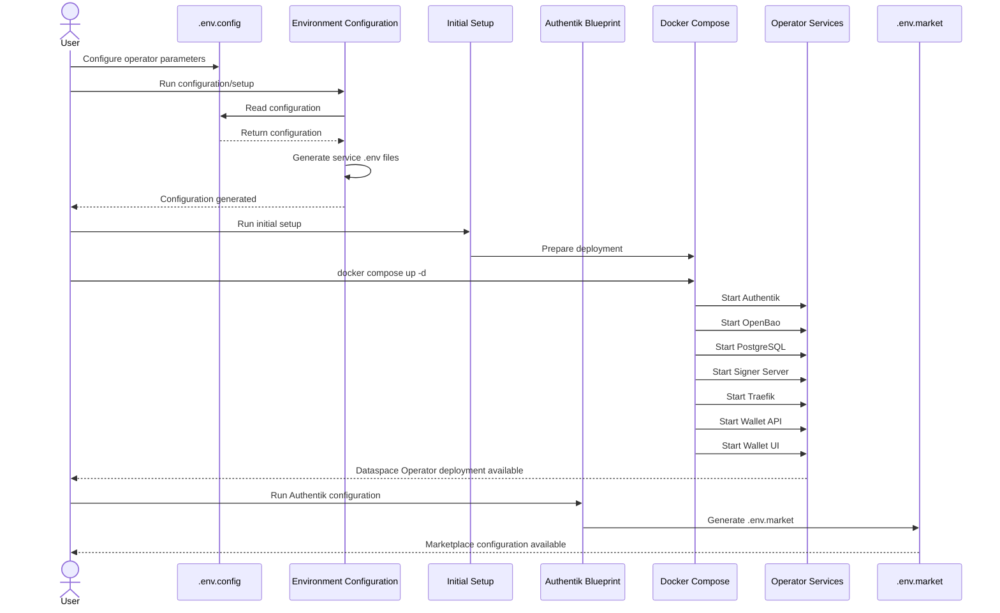
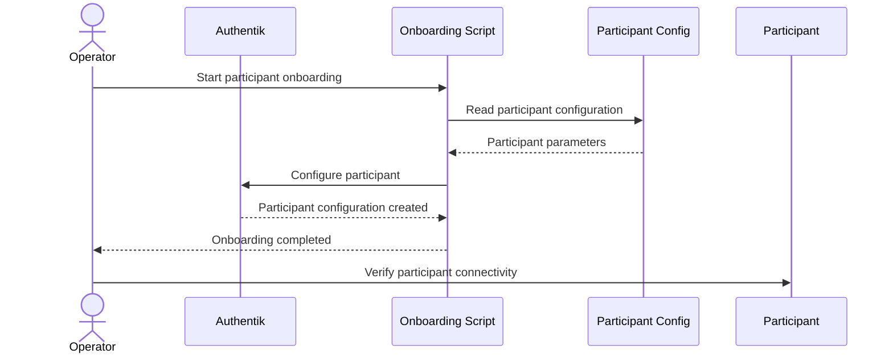
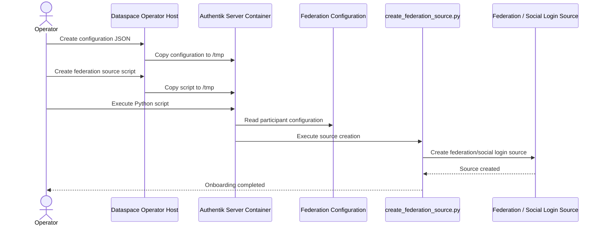

# Dataspace Operator

The `dataspace-operator` module provides the deployment and configuration tooling required to provision a **Dataspace Operator** for the Ocean Enterprise Marketplace ecosystem.

The deployment is based on Docker Compose and includes authentication, secrets management, database, signing, reverse proxy, and wallet services.

---

## Contents

- [Overview](#overview)
- [Prerequisites](#prerequisites)
- [Directory Structure](#directory-structure)
- [Configuration](#configuration)
- [Generated `.env` Files](#generated-env-files)
- [Marketplace Configuration](#marketplace-configuration)
- [Initial Setup](#initial-setup)
- [Starting the Deployment](#starting-the-deployment)
- [Onboarding a Participant](#onboarding-a-participant)
- [Federation and Social Login Source Onboarding](#federation-and-social-login-source-onboarding)
- [Services](#services)
- [Stopping the Deployment](#stopping-the-deployment)
- [Updating the Deployment](#updating-the-deployment)
- [Troubleshooting](#troubleshooting)
- [Security](#security)
- [Related Documentation](#related-documentation)

---

## Overview

The Dataspace Operator deployment contains the following major components:

| Component | Purpose |
|---|---|
| Authentik | Identity and authentication |
| OpenBao | Secrets management |
| PostgreSQL | Database backend |
| Signer Server | Signing functionality |
| Traefik | Reverse proxy and TLS |
| Wallet API | Wallet backend |
| Wallet UI | Wallet frontend |
| Participant onboarding | Automated participant onboarding |
| Federation / Social Login | Federation source configuration for participant identity providers |

The deployment is orchestrated by:

```text
docker-compose.yml
````

---

## Prerequisites

### Supported Operating Systems

The initial setup script is intended to run on the following Unix distributions:

* Fedora
* Alpine Linux
* openSUSE
* CentOS

### Required Software

Install the latest stable versions of:

* Git
* Docker
* Docker Compose
* Python

Verify the installation:

```bash
docker --version
docker compose version
git --version
python3 --version
```

Install the Python dependencies:

```bash
pip install -r requirements.txt
```

---

## Directory Structure

The repository contains source configuration and deployment files.

Generated service-specific `.env` files are intentionally excluded from this tree because they are created by the initial setup process.

```text
dataspace-operator/
├── authentik/
│   └── dataspace_operator_blueprint.py
│
├── docker-compose/
│   ├── authentik/
│   │   ├── blueprints/
│   │   │   └── dataspace-operator-authentik-blueprint.yaml
│   │   ├── certs/
│   │   ├── participant-configs/
│   │   └── scripts/
│   │       └── dataspace_operator_add_participant.py
│   │
│   ├── openbao/
│   │   ├── certs/
│   │   ├── secrets/
│   │   ├── private_keys/
│   │   ├── Dockerfile
│   │   ├── docker-entrypoint.sh
│   │   ├── init-vault.sh
│   │   ├── manage-accounts.sh
│   │   └── openbao.hcl
│   │
│   ├── postgres-init/
│   │   └── create-authentik-db.sh
│   │
│   ├── signer-server/
│   │   └── certs/
│   │
│   ├── traefik/
│   │   ├── certs/
│   │   └── dynamic/
│   │
│   └── wallet-api/
│       ├── config/
│       └── data/
│
├── wallet-ui/
├── .env
├── .env.config
├── docker-compose.yml
├── dataspace_operator_environment_configuration.py
├── dataspace-operator-initial-setup.sh
└── requirements.txt
```

The `.env.*` files generated for individual services and the `.env.market` file are intentionally not shown in the source tree above.

They are generated as part of the deployment/configuration process.

---

## Configuration

The Dataspace Operator deployment uses two main input configuration files.

### `.env`

`.env` is used for **Docker image tags and versions**.

It controls the versions of the container images used by the deployment.

Users should update image versions in this file when a different image release needs to be deployed.

### `.env.config`

`.env.config` contains the Dataspace Operator deployment configuration.

It is consumed by:

```text
dataspace_operator_environment_configuration.py
```

The configuration script uses `.env.config` to generate the environment files required by individual services.

Users should configure `.env.config` rather than manually editing generated service `.env` files.

---

## Generated `.env` Files

The initial setup/configuration process generates service-specific environment files.

Depending on the deployment configuration, these include:

```text
docker-compose/authentik/.env.authentik
docker-compose/openbao/.env.openbao
docker-compose/postgres-init/.env.postgres
docker-compose/signer-server/.env.signer-server
docker-compose/traefik/.env.traefik
docker-compose/wallet-api/.env.wallet-api
docker-compose/wallet-ui/.env.wallet-ui
```

These files are generated from the deployment configuration and should not normally be edited manually.

If configuration needs to be changed:

1. Update `.env` or `.env.config`.
2. Run the environment configuration/setup process.
3. Verify the generated files.
4. Start or restart the deployment.

---

## Marketplace Configuration

The Dataspace Operator generates a dedicated marketplace configuration file:

```text
.env.market
```

This file is generated in the **root directory of the Dataspace Operator deployment**.

The `.env.market` file is generated by:

```text
authentik/dataspace_operator_blueprint.py
```

### Purpose of `.env.market`

`.env.market` contains the configuration required by the **Ocean Enterprise Marketplace** to configure its **Central Identity Provider (Central IdP)** for the Dataspace Operator.

The generated file is intended to be shared with the Marketplace deployment/operator.

The integration flow is:

```text
Dataspace Operator
       |
       | Run Authentik configuration
       v
dataspace_operator_blueprint.py
       |
       | generates
       v
.env.market
       |
       | shared with
       v
Ocean Enterprise Marketplace
       |
       | configures
       v
Marketplace Central IdP
```

### Important

`.env.market` is a **generated file**.

It should not be manually created or maintained as the primary source of configuration.

If the Dataspace Operator configuration changes, regenerate the configuration and use the newly generated `.env.market` when configuring the Marketplace.

The generated `.env.market` may contain configuration information required for integration with the Marketplace. Handle and share the file according to the deployment's security requirements.

---

## Initial Setup

The Dataspace Operator deployment provides:

```text
dataspace-operator-initial-setup.sh
```

The initial setup prepares the environment and generates the service-specific configuration required by the Docker Compose deployment.

Make the script executable if required:

```bash
chmod +x dataspace-operator-initial-setup.sh
```

Run the setup:

```bash
./dataspace-operator-initial-setup.sh
```

The setup process should be executed before starting the Docker Compose stack on a new deployment.

---

## Deployment Flow

The complete deployment flow is:



---

## Starting the Deployment

After completing the initial setup, start the deployment from the `dataspace-operator` directory:

```bash
docker compose up -d
```

Check the status:

```bash
docker compose ps
```

View logs:

```bash
docker compose logs
```

Follow all logs:

```bash
docker compose logs -f
```

Follow a specific service:

```bash
docker compose logs -f <service-name>
```

---

## Onboarding a Participant

The Dataspace Operator deployment provides automated tooling for onboarding Participants.

Participant-specific configuration is handled under:

```text
docker-compose/authentik/participant-configs/
```

The onboarding functionality is implemented through the Authentik onboarding scripts.

### When to onboard a Participant

Participant onboarding should be performed **after the Dataspace Operator deployment has been initialized and its required services are running**.

The operator should first be configured and started successfully before attempting to onboard a Participant.

### Onboarding flow



### Running the onboarding script

From the Dataspace Operator directory, run:

```bash
./docker-compose/authentik/onboard-participant.sh
```

If the script provides command-line help, it can be checked with:

```bash
./docker-compose/authentik/onboard-participant.sh --help
```

The Python implementation can also be invoked directly when required:

```bash
python docker-compose/authentik/scripts/dataspace_operator_add_participant.py
```

The onboarding scripts should be preferred over manually modifying Authentik configuration.

---

## Federation and Social Login Source Onboarding

The Dataspace Operator Authentik deployment supports onboarding a **federation source / social login source** for a Participant.

This process creates the federation source inside the running Authentik instance using the provided configuration.

The onboarding process consists of three steps:

1. Create the federation source configuration JSON.
2. Copy the configuration and onboarding script into the Authentik container.
3. Execute the onboarding script inside the Authentik container.

> **Prerequisite:** Authentik must already be running before performing federation and social login source onboarding.

### Step 1: Create the Federation Source Configuration

Create the Participant-specific configuration file:

```text
config-for-onboarding-tvl-participant.json
```

From the Dataspace Operator root directory:

```bash
cd ~/user-management/dataspace-operator
```

Create the configuration file:

```bash
nano config-for-onboarding-tvl-participant.json
```

After creating the file, copy it into the running Authentik server container:

```bash
docker cp config-for-onboarding-tvl-participant.json authentik-server:/tmp/
```

The configuration file contains the parameters required to create the federation/social login source for the Participant.

### Step 2: Create and Copy the Federation Source Script

Navigate to the Authentik configuration directory:

```bash
cd ~/user-management/dataspace-operator/authentik
```

Create the federation source creation script:

```bash
nano create_federation_source.py
```

Copy the script into the running Authentik server container:

```bash
docker cp create_federation_source.py authentik-server:/tmp/
```

At this point, the Authentik container should contain both files:

```text
/tmp/config-for-onboarding-tvl-participant.json
/tmp/create_federation_source.py
```

### Step 3: Run the Federation Source Onboarding

Execute the script inside the Authentik server container:

```bash
docker exec -it authentik-server \
  /ak-root/.venv/bin/python \
  /tmp/create_federation_source.py \
  --config /tmp/config-for-onboarding-tvl-participant.json
```

The script reads the Participant-specific configuration and creates the federation/social login source in Authentik.

### Federation Source Onboarding Flow



---

## Services

### Authentik

Authentik provides identity and authentication for the Dataspace Operator.

Operator-specific Authentik configuration is provided through:

```text
authentik/dataspace_operator_blueprint.py
```

and:

```text
docker-compose/authentik/blueprints/dataspace-operator-authentik-blueprint.yaml
```

The Authentik configuration is also responsible for generating the Marketplace configuration:

```text
.env.market
```

---

### OpenBao

OpenBao provides secrets management.

The source configuration includes:

```text
docker-compose/openbao/
├── certs/
├── secrets/
├── private_keys/
├── Dockerfile
├── docker-entrypoint.sh
├── init-vault.sh
├── manage-accounts.sh
└── openbao.hcl
```

The `secrets/`, `private_keys/`, and certificate material should be treated as sensitive.

---

### PostgreSQL

PostgreSQL provides the database backend.

Database initialization is handled through:

```text
docker-compose/postgres-init/create-authentik-db.sh
```

---

### Signer Server

The Signer Server provides signing functionality.

Its configuration and certificates are located under:

```text
docker-compose/signer-server/
```

---

### Traefik

Traefik provides reverse proxy and TLS functionality.

Its configuration is located under:

```text
docker-compose/traefik/
├── certs/
└── dynamic/
```

---

### Wallet API

The Wallet API provides backend wallet functionality.

Configuration and data directories are located under:

```text
docker-compose/wallet-api/
├── config/
└── data/
```

---

### Wallet UI

The Wallet UI provides the frontend wallet interface.

Its service-specific environment configuration is generated as:

```text
docker-compose/wallet-ui/.env.wallet-ui
```

---

## Stopping the Deployment

Stop the running services:

```bash
docker compose down
```

Do not remove persistent volumes unless you intentionally want to remove stored service data.

---

## Updating the Deployment

Pull the latest repository changes:

```bash
git pull
```

Review changes to configuration and setup scripts.

Pull updated images:

```bash
docker compose pull
```

Start the updated deployment:

```bash
docker compose up -d
```

If images need to be rebuilt locally:

```bash
docker compose build
docker compose up -d
```

---

## Troubleshooting

Check service status:

```bash
docker compose ps
```

Check all logs:

```bash
docker compose logs
```

Check a specific service:

```bash
docker compose logs <service-name>
```

For Authentik specifically:

```bash
docker compose logs -f authentik-server
```

### Federation Source Onboarding

If federation source onboarding fails, verify:

1. Authentik is running.
2. The `authentik-server` container exists.
3. `config-for-onboarding-tvl-participant.json` was copied successfully.
4. `create_federation_source.py` was copied successfully.
5. Both files exist under `/tmp/` inside the container.
6. The configuration contains the required Participant/federation parameters.
7. The Python command uses the Python environment available inside the Authentik container.

Verify that the files exist inside the container:

```bash
docker exec -it authentik-server ls -l /tmp/
```

### `.env.market` Generation

If `.env.market` is not generated, verify:

1. Authentik has been started successfully.
2. The Dataspace Operator Authentik blueprint has been executed.
3. `authentik/dataspace_operator_blueprint.py` completed without errors.
4. The required Dataspace Operator configuration is present.
5. Check the Authentik logs for blueprint/configuration errors.

---

## Security

The Dataspace Operator deployment manages authentication, credentials, secrets, certificates, and private keys.

Never commit production secrets or private keys.

The following should be treated as sensitive:

```text
docker-compose/openbao/secrets/
docker-compose/openbao/private_keys/
docker-compose/openbao/certs/
docker-compose/traefik/certs/
docker-compose/signer-server/certs/
.env.config
generated .env files
.env.market
```

The `.env.market` file is generated for integration with the Ocean Enterprise Marketplace and should only be shared with the intended Marketplace deployment/operator.

For production deployments:

* Use strong credentials.
* Use production TLS certificates.
* Protect private keys.
* Restrict access to OpenBao.
* Review Traefik exposure.
* Secure Docker volumes.
* Ensure generated environment files are not committed.
* Protect `.env.market` according to the sensitivity of the values it contains.

---

## Related Documentation

* [User Management](../README.md)
* [Participant](../participant/README.md)

```
