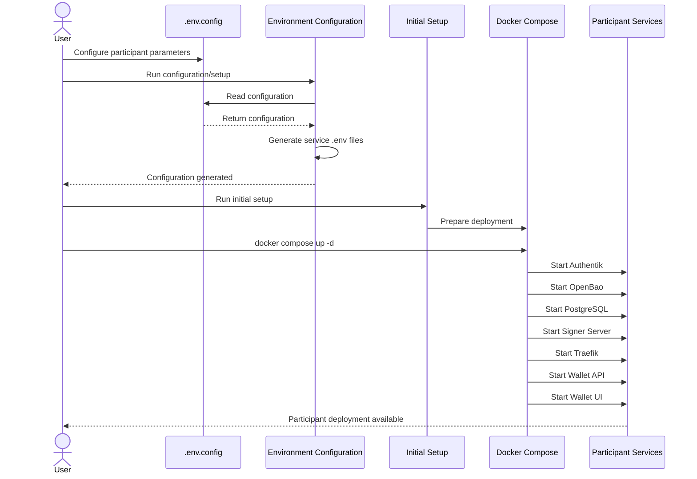

# Participant

The `participant` module provides the deployment and configuration tooling required to provision a **Participant** for the Ocean Enterprise Marketplace ecosystem.

The deployment is based on Docker Compose and provides authentication, secrets management, database, signing, reverse proxy, and wallet services.

---

# Contents

* [Overview](#overview)
* [Prerequisites](#prerequisites)
* [Directory Structure](#directory-structure)
* [Configuration](#configuration)
* [Generated `.env` Files](#generated-env-files)
* [Initial Setup](#initial-setup)
* [Starting the Deployment](#starting-the-deployment)
* [Services](#services)
* [Stopping the Deployment](#stopping-the-deployment)
* [Updating the Deployment](#updating-the-deployment)
* [Troubleshooting](#troubleshooting)
* [Security](#security)
* [Related Documentation](#related-documentation)

---

# Overview

The Participant deployment contains the following major components:

| Component     | Purpose                     |
| ------------- | --------------------------- |
| Authentik     | Identity and authentication |
| OpenBao       | Secrets management          |
| PostgreSQL    | Database backend            |
| Signer Server | Signing functionality       |
| Traefik       | Reverse proxy and TLS       |
| Wallet API    | Wallet backend              |
| Wallet UI     | Wallet frontend             |

The complete deployment is orchestrated through:

```text
docker-compose.yml
```

---

# Prerequisites

## Supported Operating Systems

The initial setup script is intended to run on the following Unix distributions:

* Fedora
* Alpine Linux
* openSUSE
* CentOS

## Required Software

Install the latest stable versions of:

* Git
* Docker
* Docker Compose

Verify the installation:

```bash
docker --version
docker compose version
git --version
```

Python is required for the environment configuration script.

Install the Python dependencies:

```bash
pip install -r requirements.txt
```

---

# Directory Structure

The source tree contains the configuration templates, deployment definitions, scripts, and service configuration.

Generated service-specific `.env` files are not shown because they are created during the initial setup process.

```text
participant/
├── authentik/
│   └── participant_blueprint.py
│
├── docker-compose/
│   ├── authentik/
│   │   ├── blueprints/
│   │   │   └── participant-authentik-blueprint.yaml
│   │   └── certs/
│   │
│   ├── openbao/
│   │   ├── certs/
│   │   └── secrets/
│   │
│   ├── postgres-init/
│   │   └── create-authentik-db.sh
│   │
│   ├── signer-server/
│   │   └── certs/
│   │
│   ├── traefik/
│   │   ├── certs/
│   │   └── dynamic/
│   │
│   └── wallet-api/
│       ├── config/
│       └── data/
│
├── wallet-ui/
├── .env
├── .env.config
├── docker-compose.yml
├── participant_environment_configuration.py
├── participant-initial-setup.sh
└── requirements.txt
```

---

# Configuration

The Participant deployment uses two main input configuration files.

## `.env`

`.env` contains the **Docker image tags and versions** used by the deployment.

It determines which versions of the container images are deployed.

## `.env.config`

`.env.config` contains the Participant deployment configuration.

It is consumed by:

```text
participant_environment_configuration.py
```

The configuration script uses `.env.config` to generate the service-specific environment files required by the deployment.

Users should configure `.env.config` rather than manually creating or editing individual service `.env` files.

---

# Generated `.env` Files

The initial setup/configuration process generates service-specific environment files.

These include:

```text
docker-compose/authentik/.env.authentik
docker-compose/openbao/.env.openbao
docker-compose/postgres-init/.env.postgres
docker-compose/signer-server/.env.signer-server
docker-compose/traefik/.env.traefik
docker-compose/wallet-api/.env.wallet-api
docker-compose/wallet-ui/.env.wallet-ui
```

These files are generated from the deployment configuration.

They should normally **not be edited manually**.

To change a generated value:

1. Update `.env` or `.env.config`.
2. Run the configuration/setup process again.
3. Verify the generated files.
4. Restart the affected services if required.

---

# Initial Setup

The Participant module provides:

```text
participant-initial-setup.sh
```

The initial setup prepares the deployment and generates the service-specific configuration.

Make the script executable if required:

```bash
chmod +x participant-initial-setup.sh
```

Run:

```bash
./participant-initial-setup.sh
```

The initial setup should be completed before starting the Docker Compose stack on a new Participant deployment.

---

# Deployment Flow

The Participant deployment follows this sequence:



---

# Starting the Deployment

After the initial setup has completed:

```bash
docker compose up -d
```

Check the running services:

```bash
docker compose ps
```

View logs:

```bash
docker compose logs
```

Follow logs:

```bash
docker compose logs -f
```

Follow logs for a specific service:

```bash
docker compose logs -f <service-name>
```

---

# Services

## Authentik

Authentik provides identity and authentication for the Participant.

Participant-specific configuration is provided through:

```text
authentik/participant_blueprint.py
```

and:

```text
docker-compose/authentik/blueprints/participant-authentik-blueprint.yaml
```

The Participant deployment uses its own Authentik blueprint and configuration, separate from the Dataspace Operator deployment.

---

## OpenBao

OpenBao provides secrets management.

The deployment contains:

```text
docker-compose/openbao/
├── certs/
├── secrets/
├── Dockerfile
├── docker-entrypoint.sh
├── init-vault.sh
├── manage-accounts.sh
└── openbao.hcl
```

OpenBao is responsible for securely managing secrets and credentials required by the deployment.

---

## PostgreSQL

PostgreSQL provides the database backend.

Database initialization is handled through:

```text
docker-compose/postgres-init/create-authentik-db.sh
```

---

## Signer Server

The Signer Server provides signing functionality required by the Participant deployment.

Its certificates and generated configuration are located under:

```text
docker-compose/signer-server/
```

---

## Traefik

Traefik provides reverse proxy and TLS functionality.

Its source configuration is located under:

```text
docker-compose/traefik/
├── certs/
└── dynamic/
```

---

## Wallet API

The Wallet API provides backend wallet functionality.

Its source configuration and data directories are located under:

```text
docker-compose/wallet-api/
├── config/
└── data/
```

---

## Wallet UI

The Wallet UI provides the frontend wallet interface.

Its generated environment configuration is:

```text
docker-compose/wallet-ui/.env.wallet-ui
```

---

# Stopping the Deployment

Stop the deployment with:

```bash
docker compose down
```

Avoid removing persistent Docker volumes unless the stored application data is no longer required.

---

# Updating the Deployment

Pull the latest repository changes:

```bash
git pull
```

Review configuration and setup changes.

Pull updated images:

```bash
docker compose pull
```

Start the updated deployment:

```bash
docker compose up -d
```

If local images need to be rebuilt:

```bash
docker compose build
docker compose up -d
```

---

# Troubleshooting

Check service status:

```bash
docker compose ps
```

View all logs:

```bash
docker compose logs
```

View a specific service:

```bash
docker compose logs <service-name>
```

If the deployment fails during initialization, first verify:

1. `.env`
2. `.env.config`
3. generated service-specific `.env` files
4. certificates
5. Docker availability
6. required ports
7. PostgreSQL initialization
8. OpenBao initialization
9. Authentik configuration
10. Traefik routing
11. Wallet API configuration

---

# Security

The Participant deployment handles authentication credentials, secrets, certificates, private keys, and other sensitive information.

Never commit production secrets or private keys to Git.

Treat the following as sensitive:

```text
docker-compose/openbao/secrets/
docker-compose/openbao/certs/
docker-compose/traefik/certs/
docker-compose/signer-server/certs/
.env.config
generated .env files
```

For production deployments:

* use strong credentials;
* use production TLS certificates;
* protect private keys;
* restrict access to OpenBao;
* review Traefik exposure;
* secure Docker volumes;
* ensure generated environment files are not committed.

---

# Related Documentation

* [User Management](../README.md)
* [Dataspace Operator](../dataspace-operator/README.md)
